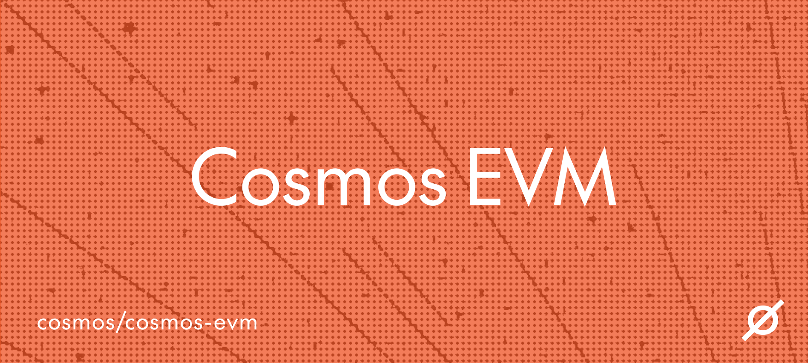

**Please note**: This repo is undergoing changes while the code is being audited and tested. For the time being we will
be making v0.x releases. Some breaking changes might occur. Cosmos Labs will only mark the Cosmos EVM repository as stable with a v1
release after the audit, key stability features and benchmarking are completed.

**Visit the official documentation for Cosmos EVM**: [evm.cosmos.network](https://evm.cosmos.network/)

## What is Cosmos EVM?

Cosmos EVM is a plug-and-play solution that adds EVM compatibility and customizability to your Cosmos SDK chain. Cosmos EVM equips Cosmos chains with complete Ethereum capabilities: Solidity smart contracts, Ethereum JSON-RPC, native support for the EVM wallet/token/user experience, and access to the entire Ethereum developer ecosystem. Its precompiles and extensions allow developers to leverage modules like [IBC](https://github.com/cosmos/ibc-go) with EVM and get native ERC-20 support for tokens on Cosmos. 

Cosmos EVM is customizable for your business use case, chain architecture, and performance needs.


## Integration

Cosmos EVM can be integrated into your existing chain
or added during the development of your upcoming chain launch
by importing Cosmos EVM as a go module library.

### Robust defaults

Cosmos EVM’s modules come out of the box with defaults that enable rapid VM deployment. Integrating all available modules into a blockchain provides:

- Exposed JSON-RPC endpoints for connectivity with EVM tooling like wallets such as [MetaMask](https://metamask.io/) and [Rabby](https://rabby.io/), and block explorers like [Blockscout](https://docs.blockscout.com/).
- EVM extensions that allow functionality that is native to Cosmos SDK modules to be accessible from Solidity smart contracts [Solidity](https://docs.soliditylang.org/en/v0.8.26/) smart contracts.
- Use of any IBC asset in the EVM.

All modules can be controlled by on-chain governance.

### Extensive customizability

Based on these robust defaults, the feature set is highly customizable:

- **Permissioned EVM**- Implement customized access controls to either blacklist or whitelist individual addresses for calling and/or creating smart contracts on the network.
- **EVM Extensions** - Use custom EVM extensions to write custom business logic for your use case.
- **Single Token Representation v2 & ERC-20 Module** - The Single Token Representation v2 and our `x/erc20` module to aligns IBC and ERC-20 token representation to simplify and improve user experience.
- **EIP-1559 Fee Market Mechanism** - Customize fee structures and transaction surge management with the self-regulating fee market mechanism based on [EIP-1559 fee market](https://eips.ethereum.org/EIPS/eip-1559).
- **JSON-RPC Server** - There is full control over the exposed namespaces and [JSON-RPC server](https://cosmos-docs.mintlify.app/docs/api-reference/ethereum-json-rpc). Configurable parameters include custom timeouts for EVM calls or HTTP requests, maximum block gas, open connections, and more.
- **EIP-712 Signing** - Integrate the [EIP-712 signature](https://eips.ethereum.org/EIPS/eip-712) implementation to allow Cosmos SDK messages to be signed with EVM wallets like MetaMask. This supports structured data signing for arbitrary messages.
- **Custom Improvement Proposals (Opcodes)** - Any Cosmos EVM user is provided the opportunity to customize bits of their EVM opcodes and add new ones. Read more on [custom operations here](https://cosmos-docs.mintlify.app/docs/documentation/smart-contracts/custom-improvement-proposals#custom-improvement-proposals).

## Compatibility with Ethereum

Is Cosmos EVM "Ethereum equivalent"? Ethereum-equivalence describes any EVM solution that is identical in transaction execution to the Ethereum client. On the other hand, Ethereum-compatible means that the EVM implementation can run every transaction that is valid on Ethereum, while also handling divergent transactions that are not valid on Ethereum.

We describe Cosmos EVM as **forward-compatible** with Ethereum. It can run any valid smart contract from Ethereum and also implement new features that are not yet available on the standard Ethereum VM, thus moving the standard forward.

## Getting started

To run the example `evmd` chain, run the script using `./local_node.sh`
from the root folder of the repository.

### Migrations

We provide upgrade guides [here](./docs/migrations) for upgrading your chain from various Cosmos EVM versions.

### Testing

All test scripts are found in `Makefile` in the root of the repository.
Listed below are the commands for various tests:

#### Unit Testing

```bash
make test-unit
```

#### Coverage Test

This generates a code coverage file `filtered_coverage.txt` and prints out the
covered code percentage for the working files.

```bash
make test-unit-cover
```

#### Fuzz Testing

```bash
make test-fuzz
```

#### Solidity Tests

```bash
make test-solidity
```

#### Benchmark Tests

```bash
make benchmark
```


## Open-source License & Credits

Cosmos EVM is fully open-source under the Apache 2.0 license. It is a fork of [evmOS](https://github.com/evmos/OS). The Interchain Foundation funded [evmOS developers](https://github.com/evmos/OS) Tharsis to open-source the original evmOS codebase.  Tharsis and evmOS performed the foundational work for EVM compatibility and
interoperability in Cosmos.

## Developer Community and Support

The issue list of this repo is exclusively for bug reports and feature requests. We have active, helpful communities on Discord, Telegram, and Slack.

**| Need Help? | Support & Community: [Discord](https://discord.com/invite/interchain) - [Telegram](https://t.me/CosmosOG) - [Talk to an Expert](https://cosmos.network/interest-form) - [Join the #Cosmos-tech Slack Channel](https://forms.gle/A8jawLgB8zuL1FN36) |**


## Maintainers
[Cosmos Labs](https://cosmoslabs.io/) maintains the core components of the stack: Cosmos SDK, CometBFT, IBC, Cosmos EVM, and various developer tools and frameworks. The detailed maintenance policy can be found [here](https://github.com/cosmos/security/blob/main/POLICY.md). In addition to developing and maintaining the Cosmos Stack, Cosmos Labs provides advisory and engineering services for blockchain solutions. [Get in touch with Cosmos Labs](https://www.cosmoslabs.io/contact).

Cosmos Labs is a wholly-owned subsidiary of the [Interchain Foundation](https://interchain.io/), the Swiss nonprofit responsible for treasury management, funding public goods, and supporting governance for Cosmos.

The Cosmos Stack is supported by a robust community of open-source contributors.

## Contributing to Cosmos EVM

We welcome open source contributions and discussions! For more on contributing, read the [guide](./CONTRIBUTING.md).

### Key Contributors to Cosmos EVM

We would like to thank our key contributors at [B-Harvest](https://bharvest.io/) and 
[Mantra](https://www.mantrachain.io/) for contributing to and helping us drive the development of Cosmos EVM.

## Documentation and Resources

### Documentation
Visit the official documentation for Cosmos EVM: [evm.cosmos.network](https://evm.cosmos.network/)

### Cosmos Stack Libraries

- [Cosmos SDK](http://github.com/cosmos/cosmos-sdk) - A framework for building
  applications in Golang
- [The Inter-Blockchain Communication Protocol (IBC)](https://github.com/cosmos/ibc-go/) - A blockchain interoperability protocol that allows blockchains to transfer any type of data encoded in bytes.
- [CometBFT](https://github.com/cometbft/cometbft) - High-performance, 10k+ TPS configurable BFT consensus engine.
