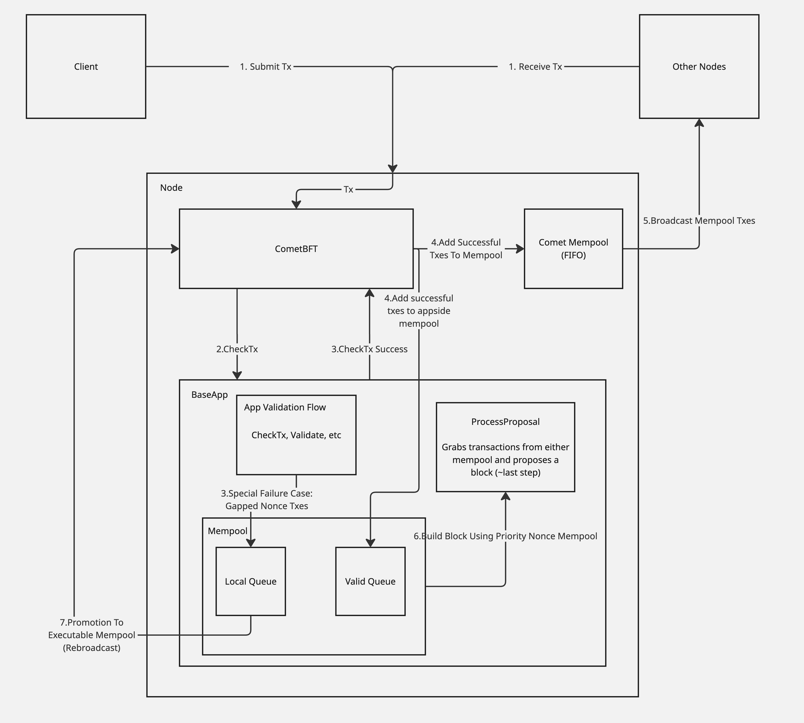

# `mempool`

> [!WARNING]
>
> This mempool implementation is **experimental** and under active development. It is intended for testing and evaluation purposes. Use in production environments is **not recommended** without thorough testing and risk assessment.
>
> Please report issues and submit feedback to help improve stability.

## Intro

This document specifies the appside mempool implementation of Cosmos EVM.

The EVM mempool is responsible for managing both EVM and Cosmos transactions in a unified pool, enabling Ethereum-compatible transaction flows including out-of-order transactions and nonce gap handling. It serves as a replacement for the default CometBFT FIFO mempool to support Ethereum tooling expectations while maintaining Cosmos SDK compatibility.

The mempool implements a two-tier architecture: a local transaction pool for queuing nonce-gapped transactions and CometBFT broadcasting for executable transactions, preventing network spam while enabling proper EVM transaction semantics.

## Contents

- [Integration](#integration)
    - [Quick Start](#quick-start)
    - [Configuration Options](#configuration-options)
    - [Prerequisites](#prerequisites)
- [Concepts](#concepts)
    - [Problem Statement](#problem-statement)
    - [Design Principles](#design-principles)
    - [Dual-Pool Transaction Management](#dual-pool-transaction-management)
    - [Transaction States](#transaction-states)
    - [Fee Prioritization](#fee-prioritization)
- [Architecture](#architecture)
    - [ExperimentalEVMMempool](#experimentalevmmempool)
    - [TxPool](#txpool)
    - [PriorityNonceMempool](#prioritynoncemempool)
    - [Miner](#miner)
    - [Iterator](#iterator)
    - [CheckTx Handler](#checktx-handler)
    - [Blockchain Interface](#blockchain-interface)
- [Transaction Flow](#transaction-flow)
- [State](#state)
- [Client](#client)
    - [JSON-RPC](#json-rpc)

## Integration

### Quick Start

To integrate the EVM mempool in your Cosmos application, follow these steps:

#### 1. Add EVM Mempool to App Struct

```go
type App struct {
    *baseapp.BaseApp
    // ... other keepers
    
    // Cosmos EVM keepers
    FeeMarketKeeper   feemarketkeeper.Keeper
    EVMKeeper         *evmkeeper.Keeper
    EVMMempool        *evmmempool.ExperimentalEVMMempool
}
```

#### 2. Configure Mempool in NewApp Constructor

> The mempool must be initialized *after* the antehandler has been set in the app.

```go
// Set the EVM priority nonce mempool
if evmtypes.GetChainConfig() != nil {
    mempoolConfig := &evmmempool.EVMMempoolConfig{
        AnteHandler:   app.GetAnteHandler(),
        BlockGasLimit: 100_000_000,
    }

    evmMempool := evmmempool.NewExperimentalEVMMempool(
        app.CreateQueryContext, 
        logger, 
        app.EVMKeeper, 
        app.FeeMarketKeeper, 
        app.txConfig, 
        app.clientCtx, 
        mempoolConfig,
    )
    app.EVMMempool = evmMempool

    // Replace BaseApp mempool
    app.SetMempool(evmMempool)
    
    // Set custom CheckTx handler for nonce gap support
    checkTxHandler := evmmempool.NewCheckTxHandler(evmMempool)
    app.SetCheckTxHandler(checkTxHandler)

    // Set custom PrepareProposal handler
    abciProposalHandler := baseapp.NewDefaultProposalHandler(evmMempool, app)
    abciProposalHandler.SetSignerExtractionAdapter(
        evmmempool.NewEthSignerExtractionAdapter(
            sdkmempool.NewDefaultSignerExtractionAdapter(),
        ),
    )
    app.SetPrepareProposal(abciProposalHandler.PrepareProposalHandler())
}

// Close unsubscribes from the CometBFT event bus (if set) and closes the underlying BaseApp.
func (app *EVMD) Close() error {
	var err error
	if m, ok := app.GetMempool().(*evmmempool.ExperimentalEVMMempool); ok {
		err = m.Close()
	}
	err = errors.Join(err, app.BaseApp.Close())
	msg := "Application gracefully shutdown"
	if err == nil {
		app.Logger().Info(msg)
	} else {
		app.Logger().Error(msg, "error", err)
	}
	return err
}

```

### Configuration Options

The `EVMMempoolConfig` struct provides several configuration options:

```go
type EVMMempoolConfig struct {
    // Required: AnteHandler for transaction validation
    AnteHandler   sdk.AnteHandler
    
    // Required: Block gas limit for transaction selection
    BlockGasLimit uint64
    
    // Optional: Custom TxPool (defaults to LegacyPool)
    TxPool        *txpool.TxPool
    
    // Optional: Custom Cosmos pool (defaults to PriorityNonceMempool)  
    CosmosPool    sdkmempool.ExtMempool
    
    // Optional: Custom broadcast function for promoted transactions
    BroadCastTxFn func(txs []*ethtypes.Transaction) error
}
```

**Minimal Configuration**:

```go
mempoolConfig := &evmmempool.EVMMempoolConfig{
    AnteHandler:   app.GetAnteHandler(),
    BlockGasLimit: 100_000_000, // 100M gas limit
}
```

**Custom Cosmos Mempool Configuration**:

The mempool uses a `PriorityNonceMempool` for Cosmos transactions by default. You can customize the priority calculation:

```go
// Define custom priority calculation for Cosmos transactions
priorityConfig := sdkmempool.PriorityNonceMempoolConfig[math.Int]{
    TxPriority: sdkmempool.TxPriority[math.Int]{
        GetTxPriority: func(goCtx context.Context, tx sdk.Tx) math.Int {
            feeTx, ok := tx.(sdk.FeeTx)
            if !ok {
                return math.ZeroInt()
            }
            
            // Get fee in bond denomination
            bondDenom := "uatom" // or your chain's bond denom
            fee := feeTx.GetFee()
            found, coin := fee.Find(bondDenom)
            if !found {
                return math.ZeroInt()
            }
            
            // Calculate gas price: fee_amount / gas_limit
            gasPrice := coin.Amount.Quo(math.NewIntFromUint64(feeTx.GetGas()))
            return gasPrice
        },
        Compare: func(a, b math.Int) int {
            return a.BigInt().Cmp(b.BigInt()) // Higher values have priority
        },
        MinValue: math.ZeroInt(),
    },
}

mempoolConfig := &evmmempool.EVMMempoolConfig{
    AnteHandler:   app.GetAnteHandler(),
    BlockGasLimit: 100_000_000,
    CosmosPool:    sdkmempool.NewPriorityMempool(priorityConfig),
}
```

**Custom Block Gas Limit**:

```go
// Example: 50M gas limit for lower capacity chains
mempoolConfig := &evmmempool.EVMMempoolConfig{
    AnteHandler:   app.GetAnteHandler(),
    BlockGasLimit: 50_000_000,
}
```

### Prerequisites

1. **EVM Module Integration**: EVM keeper and module initialized before mempool
2. **FeeMarket Module**: Required for base fee calculations  
3. **Compatible AnteHandler**: Must support EVM transaction validation

## Concepts

### Problem Statement

The default CometBFT mempool is incompatible with Ethereum tooling ([Forge](https://getfoundry.sh/), [Hardhat](https://hardhat.org/), [deployment scripts](https://devdocs.optimism.io/op-deployer/reference-guide/custom-deployments.html)) due to fundamental differences in transaction ordering expectations:

1. **FIFO vs Priority Ordering**: CometBFT uses strict FIFO ordering, while Ethereum tools expect fee-based prioritization
2. **Nonce Gap Rejection**: CometBFT immediately rejects out-of-order nonces, while Ethereum tools expect such transactions to queue until executable
3. **Base Fee Dynamics**: Transactions may become temporarily invalid due to base fee increases but should remain in the mempool

Example incompatibility from OP Stack deployment:

```
ERROR unable to publish transaction nonce=39 expected=12: invalid sequence
ERROR unable to publish transaction nonce=40 expected=12: invalid sequence
ERROR unable to publish transaction nonce=41 expected=12: invalid sequence
```

**Real-World Testing**: The [`tests/systemtests/Counter/script/SimpleSends.s.sol`](../tests/systemtests/Counter/script/SimpleSends.s.sol) script demonstrates typical Ethereum tooling behavior - it sends 10 sequential transactions in a batch, which naturally arrive out of order and create nonce gaps. With the default Cosmos mempool, this script would fail with sequence errors. With the EVM mempool, all transactions are queued locally and promoted as gaps are filled, allowing the script to succeed.

### Design Principles

1. **Instant Finality**: Designed for Cosmos chains with instant finality (no reorgs)
2. **Two-Tier Architecture**: Local queuing + CometBFT broadcasting prevents network spam
3. **Fee-Based Prioritization**: Unified fee comparison between EVM and Cosmos transactions
4. **Ethereum Compatibility**: Supports nonce gaps and transaction queuing semantics

### Dual-Pool Transaction Management

The mempool manages both Cosmos and Ethereum transactions through a unified two-pool system:

#### Transaction Type Routing

**Ethereum Transactions** (`MsgEthereumTx`):

- **Tier 1 (Local)**: EVM TxPool handles nonce gaps and promotion logic
    - Queued state for nonce-gapped transactions (stored locally, not broadcast)
    - Pending state for immediately executable transactions
    - Background promotion when gaps are filled
- **Tier 2 (Network)**: CometBFT mempool broadcasts executable transactions

**Cosmos Transactions** (Bank, Staking, Gov, etc.):

- **Direct to Tier 2**: Always go directly to CometBFT mempool (no local queuing)
- **Standard Flow**: Follow normal Cosmos SDK validation and broadcasting
- **Priority-Based**: Use `PriorityNonceMempool` for fee-based ordering

#### Unified Transaction Selection

During block building, both transaction types compete fairly:

```go
// Simplified selection logic
func SelectTransactions() Iterator {
    evmTxs := GetPendingEVMTransactions()      // From local TxPool
    cosmosTxs := GetPendingCosmosTransactions() // From Cosmos mempool
    
    return NewUnifiedIterator(evmTxs, cosmosTxs) // Fee-based priority
}
```

**Fee Comparison**:

- **EVM**: `gas_tip_cap` or `gas_fee_cap - base_fee`
- **Cosmos**: `(fee_amount / gas_limit) - base_fee`
- **Winner**: Higher effective tip gets selected first (regardless of type)

This design ensures EVM tooling gets expected nonce gap tolerance while Cosmos transactions maintain standard behavior and network performance is protected from spam.

### Transaction States

- **Pending**: Immediately executable transactions
- **Queued**: Transactions with nonce gaps awaiting prerequisites  
- **Promoted**: Background transition from queued to pending

### Fee Prioritization

Transaction selection uses effective tip calculation:

- **EVM**: `gas_tip_cap` or `min(gas_tip_cap, gas_fee_cap - base_fee)`
- **Cosmos**: `(fee_amount / gas_limit) - base_fee`

Higher effective tips are prioritized regardless of transaction type. In the event of a tie, EVM transactions are prioritized

## Architecture

### ExperimentalEVMMempool

The main coordinator implementing Cosmos SDK's `ExtMempool` interface.

**Location**: `mempool/mempool.go`

**Methods**:

- `Insert(ctx, tx)`: Routes transactions to appropriate pools
- `Select(ctx, filter)`: Returns unified iterator over all transactions  
- `Remove(tx)`: Handles transaction removal with EVM-specific logic
- `InsertInvalidNonce(txBytes)`: Queues nonce-gapped EVM transactions without broadcasting them to the chain.
A special failure case is sent via CheckTx, and the transaction is stored locally until it either gets included or evicted.

**Configuration**:

```go
type EVMMempoolConfig struct {
    TxPool        *txpool.TxPool
    CosmosPool    sdkmempool.ExtMempool
    AnteHandler   sdk.AnteHandler
    BroadCastTxFn func(txs []*ethtypes.Transaction) error
    BlockGasLimit uint64
}
```

### TxPool

Ethereum transaction pool forked from go-ethereum v1.15.11 with Cosmos adaptations.

**Location**: `mempool/txpool/`

**Modifications**:

- Uses `vm.StateDB` interface instead of go-ethereum's StateDB
- Implements `BroadcastTxFn` callback for transaction promotion. When nonce gaps are filled, the callback broadcasts
via the Comet mempool
- Cosmos-specific reset logic for instant finality. The TxPool was originally built for chains where block reorgs are possible,
but this does not apply to instant finality chains, so the mempool ensures that the reorg flow is skipped.

**Subpools**: Currently uses only `LegacyPool` for standard EVM transactions

### PriorityNonceMempool

Standard Cosmos SDK mempool for handling non-EVM transactions with fee-based prioritization.

**Purpose**: Manages all Cosmos SDK transactions (bank, staking, governance, etc.) separate from EVM transactions

**Features**:

- Fee-based transaction prioritization using configurable priority functions
- Standard Cosmos nonce validation (strict sequential ordering)
- Direct integration with CometBFT broadcasting (no local queuing)
- Compatible with all existing Cosmos SDK transaction types

**Default Priority Calculation**:

```go
// Default implementation calculates effective gas price
priority = (fee_amount / gas_limit) - base_fee
```

**Configuration**: Can be customized via `EVMMempoolConfig.CosmosPool` parameter to provide different priority algorithms, fee calculation methods, or transaction filtering logic.

**Interaction with EVM Pool**: During block building, transactions from both pools are combined via the unified iterator, with selection based on fee comparison between the effective tips of both transaction types.

### Miner

Transaction ordering mechanism from go-ethereum v1.15.11, unchanged from upstream.

**Location**: `mempool/miner/ordering.go`

**Functionality**:

- Priority heap-based transaction selection (`TransactionsByPriceAndNonce`)
- Per-account nonce ordering
- Base fee consideration for effective tip calculation

### Iterator

Unified iterator combining EVM and Cosmos transaction streams.

**Location**: `mempool/iterator.go`

**Selection Logic**:

```go
func (i *EVMMempoolIterator) shouldUseEVM() bool {
    // 1. Availability check
    // 2. Fee comparison: effective_tip_evm vs effective_tip_cosmos
    // 3. EVM preferred on ties or invalid Cosmos fees
}
```

### CheckTx Handler

Customizes transaction validation to handle nonce gaps specially.

**Location**: `mempool/check_tx.go`

**Special Handling**: On `ErrNonceGap` for EVM transactions, attempts `InsertInvalidNonce()` and returns success via the RPC to prevent client errors

### Blockchain Interface

Adapter providing go-ethereum compatibility over Cosmos SDK state.

**Location**: `mempool/blockchain.go`

**Features**:

- Block height synchronization (requires block 1+ for operation)
- State database interface translation
- Reorg protection (panics on reorg attempts)

## Transaction Flow

The following diagrams illustrate the complete transaction flow architecture, showing how transactions move through the system from initial RPC calls to block inclusion:

### Architecture Overview


### Transaction Flow



## State

The mempool module maintains the following state:

1. **EVM Transaction Pool**: Managed by forked go-ethereum txpool
   - Pending transactions (immediately executable)
   - Queued transactions (nonce gaps)
   - Account nonces and balances via StateDB interface

2. **Cosmos Transaction Pool**: Standard Cosmos SDK priority mempool
   - Priority-based transaction ordering
   - Fee-based prioritization

3. **Block Height**: Requires block 1+ before accepting transactions

## Client

### JSON-RPC

The mempool extends RPC functionality through the `/txpool` namespace compatible with go-ethereum:

#### txpool_status

Returns pool statistics (pending/queued transaction counts).

```shell
curl -X POST -H "Content-Type: application/json" \
  --data '{"method":"txpool_status","params":[],"id":1,"jsonrpc":"2.0"}' \
  http://localhost:8545
```

Example Output:

```json
{
  "jsonrpc": "2.0",
  "id": 1,
  "result": {
    "pending": 42,
    "queued": 7
  }
}
```

#### txpool_content

Returns full transaction content grouped by account and state.

```shell
curl -X POST -H "Content-Type: application/json" \
  --data '{"method":"txpool_content","params":[],"id":1,"jsonrpc":"2.0"}' \
  http://localhost:8545
```

#### txpool_contentFrom

Returns transactions from a specific address.

```shell
curl -X POST -H "Content-Type: application/json" \
  --data '{"method":"txpool_contentFrom","params":["0x1234..."],"id":1,"jsonrpc":"2.0"}' \
  http://localhost:8545
```

#### txpool_inspect

Returns transaction summaries without full transaction data.

```shell
curl -X POST -H "Content-Type: application/json" \
  --data '{"method":"txpool_inspect","params":[],"id":1,"jsonrpc":"2.0"}' \
  http://localhost:8545
```
